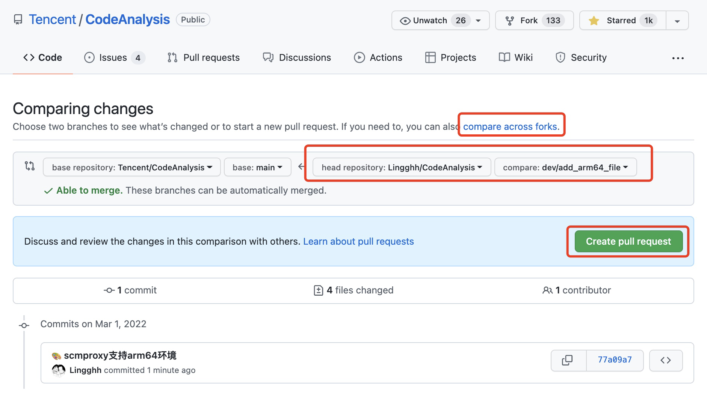

  

PR全称为Pull Request，它是一种代码库的协作方式。开发者可以通过PR将自己在代码库的修改通知到代码库负责人，由原作者评审代码并决定是否能合入。
> Pull requests let you tell others about changes you've pushed to a branch in a repository on GitHub. Once a pull request is opened, you can discuss and review the potential changes with collaborators and add follow-up commits before your changes are merged into the base branch.

#操作流程
##一、Fork目标代码库
  

  点击Fork后，会在自己名下产生一个相同代码库，比如我ForkCodeAnalysis项目后，会在我名下多出一个CodeAnalysis代码库，地址为https://github.com/Lingghh/CodeAnalysis

  ## 二、克隆Fork的代码库并创建分支
  在本地克隆Fork的代码库并创建分支

   `1.$ git clone https://github.com/Lingghh/CodeAnalysis`` `
 `2.$ git checkout -b dev/add_qa_20220301 `

 注：也可以在自己Fork的代码库GitHub页面上创建分支。
 
   

 接下来就可以在本地修改代码，修改完成后先push到Fork的代码库中.

 ## 三、在目标项目中提交PR
 ###### 1.进入到目标项目中，点击Pull requests Tab，再点击New pull request就会进入到创建PR的页面。
   

   ###### 2.进入PR页面后:
   - 点击compare across forks 。
   - 点击head repository 。
   - 选择自己Fork的代码库和比较的分支，比如我这里选择Lingghh/CodeAnalysis和待合入的分支dev/add_arm64_file 。
   - 最后确认commits和changed files是否准确，如果没有问题就可以点击Create pull request 。

   

PR创建后，代码库管理员会评审你提交的代码，并决定是否接受该PR。

###### 更多信息请参阅[GitHub PullRequest官方文档](https://docs.github.com/cn/pull-requests/collaborating-with-pull-requests/proposing-changes-to-your-work-with-pull-requests/about-pull-requests/) 

##TCA团队诚邀您的加入！

